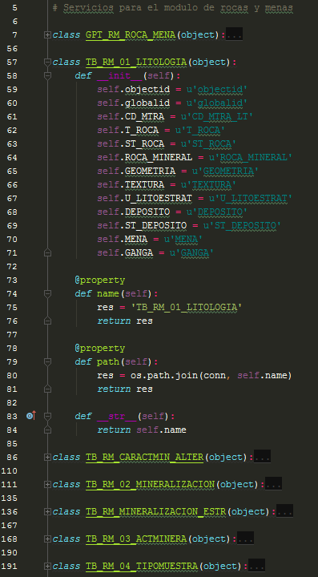
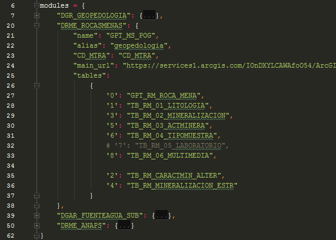
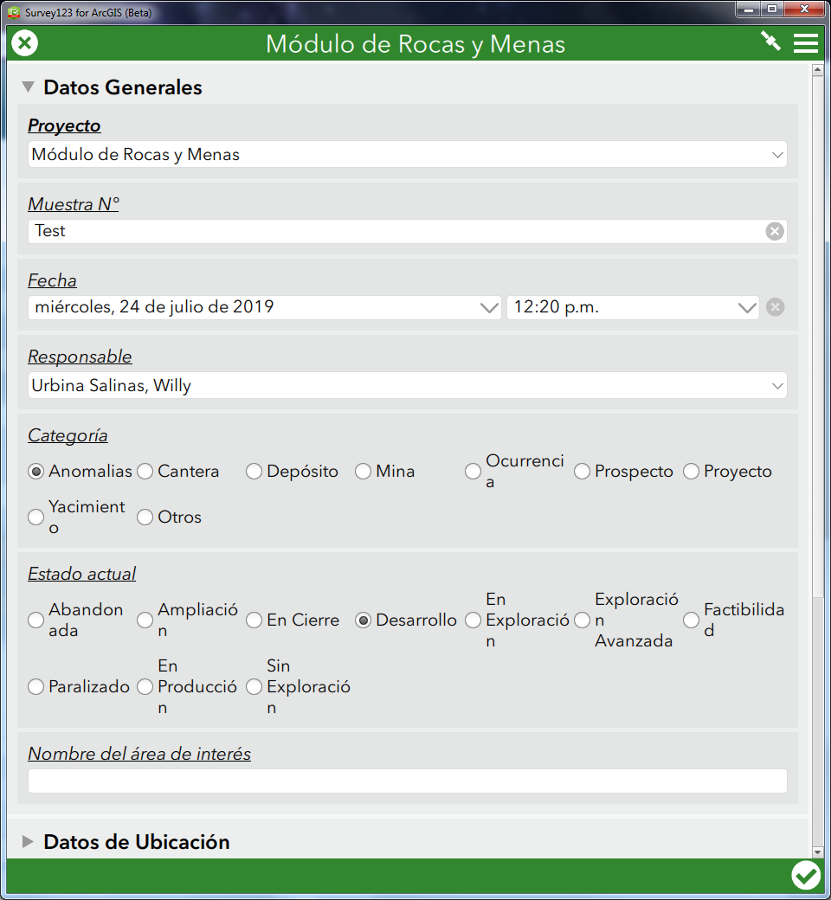
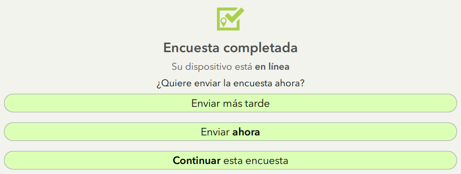
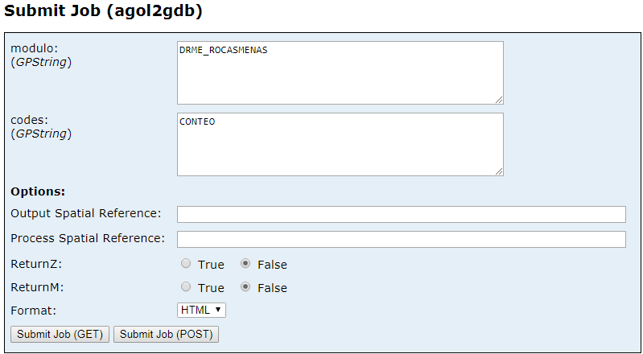
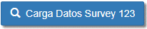
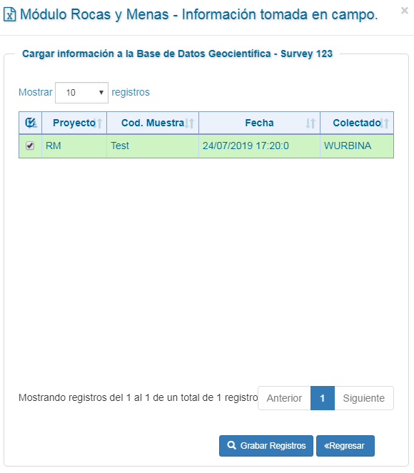
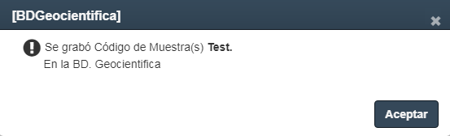
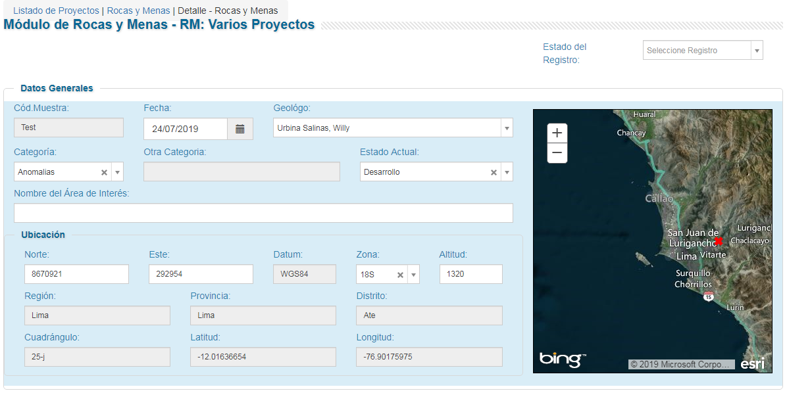

# Agol2GDB

Esta herramienta ha sido desarrollada para extraer los datos recogidos por la aplicación Survey123 a la GeodataBase corporativa de INGEMMET. 

Se ha desarrollado con el lenguaje de programación Python y guardado como Servicio de Geoproceso en la Base de datos para que pueda ser llamada cada vez que se requiera.

Este geoproceso se encuentra estandarizado para reconocer los modelos de datos que se realicen en las diferentes oficinas geocientíficas, teniendo normalizadas las nomenclaturas de los códigos de muestra y tablas relacionadas a estas.

* En caso se requiera agregar nuevos módulos, los modelos de datos deben ser agregados a los códigos ***models.py*** y ***services.py***, posteriormente podrán ser llamados con el nombre de la llave que se ha generado para la variable ***servicios***.

    

        
    

    

        
    

## Modo de uso

Para su aplicación, sólo es necesario recolectar datos de campo, como se hace regularmente, considerando que se tiene un código de identificación a la variable que se esté levantando.

En la imagen se ve el formulario Survey123, en este caso, para el módulo de Rocas y Menas.

Una vez concluida la encuesta y teniendo acceso a internet, se puede subir los datos recolectados al ArcgisOnline

El geoproceso publicado se encuentra en el siguiente link:

*https://geocatminapp.ingemmet.gob.pe/arcgis/rest/services/GEOPROCESO/agol2gdb/GPServer/agol2gdb/submitJob*

Los parámetros que requiere son:
- ***Modulo***: el módulo que ejecutará el proceso, hasta la fecha se tienen acondicionados los siguientes módulos:

  - DGR_GEOPEDOLOGIA (DGR - Geopedologia)
  - DRME_ROCASMENAS (DRME - Rocas y Menas)
  - DGAR_FUENTEAGUA_SUB (DGAR - Fuentes de Agua)
  - DRME_ANAPS (DRME - ANAPs)

- ***Codigo***: Los códigos de los datos que se encuentren en la nube (Agol) y requieran pasarse a la base de datos. * En caso se utilice el código *CONTEO* devolverá un JSON con los datos del feature principal del módulo.

## En el módulo web

Desde el módulo web se buscará la opción de carga de datos a partir de Survey123.

Esta opción llamará a los datos del feature principal como JSON y se mostrarán los principales campos en la siguiente vista.

Una vez se aplique la opción ***Grabar Registros***, esta pasará a la base de datos, siendo indicado con el siguiente mensaje.

Por último, el dato recolectado en Survey123 podrá ser visto y editado en el módulo web como lo vemos a continuación.

 by: ryali93 - INGEMMET 

